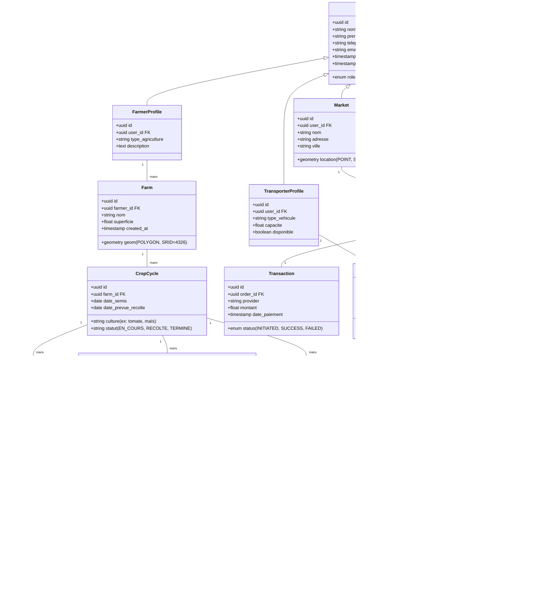

```mermaid
classDiagram
    %% === UTILISATEURS ===
    class User {
        +uuid id
        +string nom
        +string prenom
        +string telephone
        +string email
        +enum role (FARMER, TRANSPORTER, MARKET, CLIENT, ADMIN)
        +timestamp created_at
        +timestamp updated_at
    }

    class FarmerProfile {
        +uuid id
        +uuid user_id FK
        +string type_agriculture
        +text description
    }

    class TransporterProfile {
        +uuid id
        +uuid user_id FK
        +string type_vehicule
        +float capacite
        +boolean disponible
    }

    class Market {
        +uuid id
        +uuid user_id FK
        +string nom
        +geometry location (POINT, SRID=4326)
        +string adresse
        +string ville
    }

    class ClientProfile {
        +uuid id
        +uuid user_id FK
        +string type_client
    }

    %% === GESTION AGRICOLE ===
    class Farm {
        +uuid id
        +uuid farmer_id FK
        +string nom
        +geometry geom (POLYGON, SRID=4326)
        +float superficie
        +timestamp created_at
    }

    class CropCycle {
        +uuid id
        +uuid farm_id FK
        +string culture (ex: tomate, maïs)
        +date date_semis
        +date date_prevue_recolte
        +string statut (EN_COURS, RECOLTE, TERMINE)
    }

    class Seed {
        +uuid id
        +uuid crop_cycle_id FK
        +string variete
        +float quantite_semence
        +string fournisseur
        +date date_utilisation
    }

    class Monitoring {
        +uuid id
        +uuid crop_cycle_id FK
        +date date_action
        +string type_action (ARROSAGE, ENGRAIS, TRAITEMENT, MALADIE, NOTE)
        +text details
        +float quantite
        +string unite
    }

    class Harvest {
        +uuid id
        +uuid crop_cycle_id FK
        +date date_recolte
        +float quantite
        +string unite
        +string qualite
    }

    class Product {
        +uuid id
        +uuid harvest_id FK
        +string nom
        +string categorie
        +float prix_unitaire
        +float quantite_disponible
        +boolean en_vente
    }

    %% === COMMERCE ===
    class Order {
        +uuid id
        +uuid client_id FK
        +uuid market_id FK
        +enum status (PENDING, PAID, SHIPPED, DELIVERED, CANCELED)
        +float montant_total
        +timestamp created_at
    }

    class OrderItem {
        +uuid id
        +uuid order_id FK
        +uuid product_id FK
        +float quantite
        +float prix_unitaire
    }

    class Transaction {
        +uuid id
        +uuid order_id FK
        +string provider
        +enum status (INITIATED, SUCCESS, FAILED)
        +float montant
        +timestamp date_paiement
    }

    %% === TRANSPORT ===
    class Shipment {
        +uuid id
        +uuid order_id FK
        +uuid transporter_id FK
        +enum status (PENDING, ASSIGNED, IN_TRANSIT, DELIVERED)
        +geometry trajet (LINESTRING, SRID=4326)
        +float prix_transport
        +timestamp created_at
    }

    class Tracking {
        +uuid id
        +uuid shipment_id FK
        +geometry position (POINT, SRID=4326)
        +timestamp timestamp
        +float vitesse
    }

    %% === RELATIONS ===
    User <|-- FarmerProfile
    User <|-- TransporterProfile
    User <|-- ClientProfile
    User <|-- Market

    FarmerProfile "1" -- "many" Farm
    Farm "1" -- "many" CropCycle
    CropCycle "1" -- "many" Seed
    CropCycle "1" -- "many" Monitoring
    CropCycle "1" -- "many" Harvest
    Harvest "1" -- "many" Product

    ClientProfile "1" -- "many" Order
    Market "1" -- "many" Order
    Order "1" -- "many" OrderItem
    Order "1" -- "1" Transaction
    Order "1" -- "1" Shipment
    Shipment "1" -- "many" Tracking
    Product "1" -- "many" OrderItem
    TransporterProfile "1" -- "many" Shipment

```