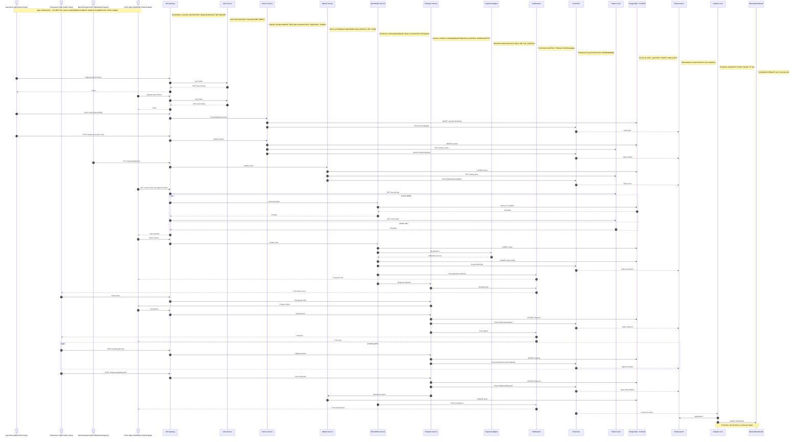

```mermaid
sequenceDiagram
    autonumber

    %% === Acteurs / Apps ===
    actor FarmerApp as Agriculteur (App mobile Flutter)
    actor TransporterApp as Transporteur (App mobile Flutter)
    actor MarketDash as Marché/Supermarché (Dashboard Angular)
    actor ClientApp as Client (App mobile/web Flutter/Angular)

    %% === Backend / Middleware ===
    participant APIGW as API Gateway
    participant Auth as Auth Service
    participant FarmerSvc as Farmer Service
    participant MarketSvc as Market Service
    participant ClientSvc as Client/Order Service
    participant TransportSvc as Transport Service
    participant PayAdapter as Payment Adapter
    participant Notif as Notifications
    participant Bus as Event Bus

    %% === Data Layer ===
    participant Cache as Redis Cache
    participant DB as PostgreSQL + PostGIS
    participant ES as Elasticsearch
    participant Analytics as Analytics & IA
    participant Kibana as Kibana/Dashboards

    %% === Notes Rôles & Tech ===
    Note over FarmerApp,ClientApp: Apps mobiles/web → UX offline-first, cartes (Leaflet/Mapbox)\nObjectif: simplicité & rapidité\nTech: Flutter, Angular
    Note right of APIGW: Orchestration, sécurité, rate-limit\nTech: Spring Boot/NestJS, JWT, OpenAPI
    Note right of Auth: Auth multi-rôles\nTech: Keycloak (OIDC, RBAC)
    Note right of FarmerSvc: Champs, récoltes\nObjectif: CRUD géo & produits\nTech: Spring Boot + PostGIS
    Note right of MarketSvc: Stocks, prix\nObjectif: disponibilité temps réel\nTech: JPA + Redis
    Note right of ClientSvc: Recherche, commandes\nObjectif: panier & orders\nTech: Spring Boot
    Note right of TransportSvc: Courses, enchères, tracking\nObjectif: Matching & suivi\nTech: WebSocket/HTTP
    Note right of PayAdapter: Abstraction paiements\nTech: Wave, OM, Free, PayDunya
    Note right of Notif: Push temps réel\nTech: Firebase Cloud Messaging
    Note right of Bus: Événements asynchrones\nTech: Kafka/RabbitMQ
    Note right of DB: Source de vérité + géo\nTech: PostGIS, indexes GIST
    Note right of ES: Historisation & recherche\nTech: ILM, analyzers
    Note right of Analytics: Prévisions, stats\nTech: Python, Pandas, TF Lite
    Note right of Kibana: Visualisation\nObjectif: suivi en temps réel

    %% === 1) Inscription ===
    FarmerApp->>APIGW: Signup/Login (Farmer)
    APIGW->>Auth: Auth OIDC
    Auth-->>APIGW: JWT (role=Farmer)
    APIGW-->>FarmerApp: Token
    ClientApp->>APIGW: Signup/Login (Client)
    APIGW->>Auth: Auth OIDC
    Auth-->>APIGW: JWT (role=Client)
    APIGW-->>ClientApp: Token

    %% === 2) Création du champ & produit ===
    FarmerApp->>APIGW: POST /farms {GeoJSON}
    APIGW->>FarmerSvc: Create/Update parcelle
    FarmerSvc->>DB: INSERT parcelle (PostGIS)
    FarmerSvc->>Bus: Event FarmUpdated
    Bus-->>ES: Index farm
    FarmerApp->>APIGW: POST /products {récolte, prix}
    APIGW->>FarmerSvc: Publish produit
    FarmerSvc->>DB: INSERT produit
    FarmerSvc->>Cache: SET product cache
    FarmerSvc->>Bus: Event ProductPublished
    Bus-->>ES: Index produit

    %% === 3) Mise à jour stock marché ===
    MarketDash->>APIGW: PUT /markets/{id}/stock
    APIGW->>MarketSvc: Update stock
    MarketSvc->>DB: UPSERT stock
    MarketSvc->>Cache: SET market stock
    MarketSvc->>Bus: Event MarketStockUpdated
    Bus-->>ES: Index stock

    %% === 4) Client recherche produits proches ===
    ClientApp->>APIGW: GET /search?near=lat,lng&cat=tomate
    APIGW->>Cache: GET near:tomate
    alt Cache MISS
        APIGW->>ClientSvc: Search produits
        ClientSvc->>DB: Query ST_DWithin
        DB-->>ClientSvc: Résultats
        ClientSvc-->>APIGW: Produits
        APIGW->>Cache: SET near:tomate
    else Cache HIT
        Cache-->>APIGW: Résultats
    end
    APIGW-->>ClientApp: Liste produits

    %% === 5) Commande & Paiement ===
    ClientApp->>APIGW: POST /orders
    APIGW->>ClientSvc: Create order
    ClientSvc->>DB: INSERT order
    ClientSvc->>PayAdapter: Init paiement
    PayAdapter-->>ClientSvc: Webhook success
    ClientSvc->>DB: UPDATE order=PAID
    ClientSvc->>Bus: Event OrderPaid
    Bus-->>ES: Index transaction
    ClientSvc->>Notif: Push paiement confirmé
    Notif-->>ClientApp: 🔔 Paiement OK

    %% === 6) Livraison ===
    ClientSvc->>TransportSvc: Request shipment
    TransportSvc->>Notif: Broadcast job
    Notif-->>TransporterApp: 🔔 Nouvelle course
    TransporterApp->>APIGW: POST /bids
    APIGW->>TransportSvc: Enregistrer offre
    TransportSvc->>ClientApp: Propose offres
    ClientApp->>APIGW: Accept bid
    APIGW->>TransportSvc: Assign driver
    TransportSvc->>DB: UPDATE shipment
    TransportSvc->>Bus: Event ShipmentAssigned
    Bus-->>ES: Index shipment
    TransportSvc->>Notif: Push départ
    Notif-->>TransporterApp: 🧭 Itinéraire
    Notif-->>ClientApp: 🚚 En route

    %% === 7) Tracking GPS & Livraison ===
    loop Tracking GPS
        TransporterApp->>APIGW: POST /tracking {lat,lng}
        APIGW->>TransportSvc: Update position
        TransportSvc->>DB: UPSERT tracking
        TransportSvc->>Bus: Event ShipmentLocationUpdated
        Bus-->>ES: Append location
    end
    TransporterApp->>APIGW: POST /shipment/{id}/delivered
    APIGW->>TransportSvc: Close shipment
    TransportSvc->>DB: UPDATE delivered
    TransportSvc->>Bus: Event ShipmentDelivered
    Bus-->>ES: Index DELIVERED
    TransportSvc->>MarketSvc: Décrément stock
    MarketSvc->>DB: UPDATE stock
    ClientSvc->>Notif: Push reçu/facture
    Notif-->>ClientApp: 🧾 Commande livrée

    %% === 8) Analytics ===
    Bus-->>Analytics: Consume events
    Analytics->>ES: Agrégations
    Analytics->>Kibana: Update dashboards
    Note over Analytics,Kibana: Prévisions, SLA livraisons, ventes par région


```