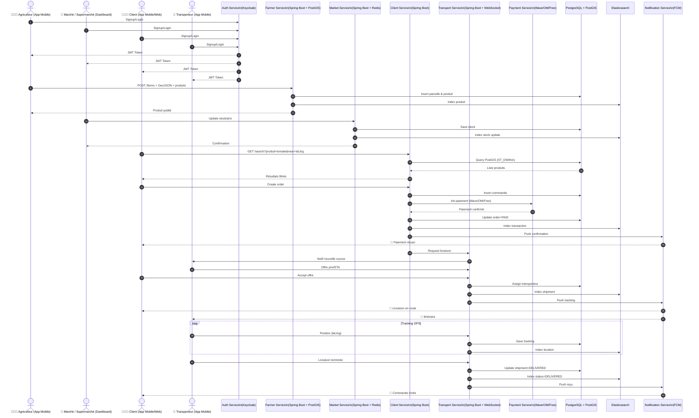

```mermaid
sequenceDiagram
    autonumber

    %% Acteurs principaux
    actor Farmer as 👨🏿‍🌾 Agriculteur (App Mobile)
    actor Market as 🛒 Marché / Supermarché (Dashboard)
    actor Client as 👩🏾‍🍳 Client (App Mobile/Web)
    actor Transporter as 🚚 Transporteur (App Mobile)

    %% Backend / Services
    participant Auth as Auth Service\n(Keycloak)
    participant FarmerSvc as Farmer Service\n(Spring Boot + PostGIS)
    participant MarketSvc as Market Service\n(Spring Boot + Redis)
    participant ClientSvc as Client Service\n(Spring Boot)
    participant TransportSvc as Transport Service\n(Spring Boot + WebSocket)
    participant Payment as Payment Service\n(Wave/OM/Free)
    participant DB as PostgreSQL + PostGIS
    participant ES as Elasticsearch
    participant Notif as Notification Service\n(FCM)

    %% 1. Inscription & Auth
    Farmer->>Auth: Signup/Login
    Market->>Auth: Signup/Login
    Client->>Auth: Signup/Login
    Transporter->>Auth: Signup/Login
    Auth-->>Farmer: JWT Token
    Auth-->>Market: JWT Token
    Auth-->>Client: JWT Token
    Auth-->>Transporter: JWT Token

    %% 2. Agriculteur publie une récolte
    Farmer->>FarmerSvc: POST /farms + GeoJSON + produits
    FarmerSvc->>DB: Insert parcelle & produit
    FarmerSvc->>ES: Index produit
    FarmerSvc-->>Farmer: Produit publié

    %% 3. Marché met à jour ses stocks
    Market->>MarketSvc: Update stock/prix
    MarketSvc->>DB: Save stock
    MarketSvc->>ES: Index stock update
    MarketSvc-->>Market: Confirmation

    %% 4. Client recherche produits proches
    Client->>ClientSvc: GET /search?produit=tomate&near=lat,lng
    ClientSvc->>DB: Query PostGIS (ST_DWithin)
    DB-->>ClientSvc: Liste produits
    ClientSvc-->>Client: Résultats filtrés

    %% 5. Commande & Paiement
    Client->>ClientSvc: Create order
    ClientSvc->>DB: Insert commande
    ClientSvc->>Payment: Init paiement (Wave/OM/Free)
    Payment-->>ClientSvc: Paiement confirmé
    ClientSvc->>DB: Update order=PAID
    ClientSvc->>ES: Index transaction
    ClientSvc->>Notif: Push confirmation
    Notif-->>Client: 🔔 Paiement réussi

    %% 6. Livraison (Transport)
    ClientSvc->>TransportSvc: Request livraison
    TransportSvc->>Transporter: Notif nouvelle course
    Transporter->>TransportSvc: Offre prix/ETA
    Client->>TransportSvc: Accept offre
    TransportSvc->>DB: Assign transporteur
    TransportSvc->>ES: Index shipment
    TransportSvc->>Notif: Push tracking
    Notif-->>Client: 🚚 Livraison en route
    Notif-->>Transporter: 🧭 Itinéraire

    %% 7. Suivi & Livraison finale
    loop Tracking GPS
        Transporter->>TransportSvc: Position {lat,lng}
        TransportSvc->>DB: Save tracking
        TransportSvc->>ES: Index location
    end
    Transporter->>TransportSvc: Livraison terminée
    TransportSvc->>DB: Update shipment=DELIVERED
    TransportSvc->>ES: Index status=DELIVERED
    TransportSvc->>Notif: Push reçu
    Notif-->>Client: 🧾 Commande livrée

```