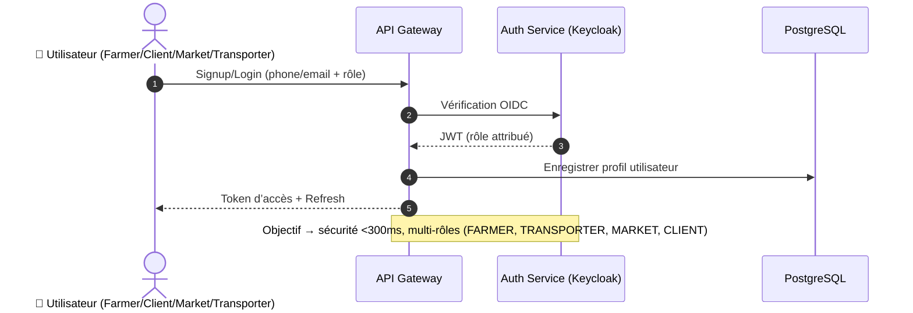

```mermaid
sequenceDiagram
    autonumber
    actor User as 👤 Utilisateur (Farmer/Client/Market/Transporter)
    participant APIGW as API Gateway
    participant Auth as Auth Service (Keycloak)
    participant DB as PostgreSQL

    User->>APIGW: Signup/Login (phone/email + rôle)
    APIGW->>Auth: Vérification OIDC
    Auth-->>APIGW: JWT (rôle attribué)
    APIGW->>DB: Enregistrer profil utilisateur
    APIGW-->>User: Token d’accès + Refresh

    Note over Auth,APIGW: Objectif → sécurité <300ms, multi-rôles (FARMER, TRANSPORTER, MARKET, CLIENT)

```