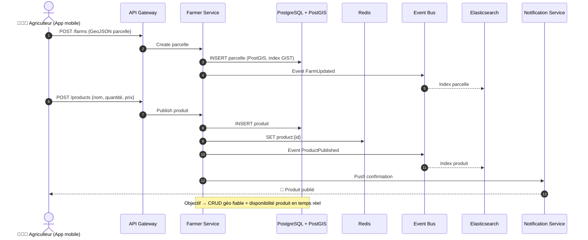

```mermaid
sequenceDiagram
    autonumber
    actor Farmer as 👨🏿‍🌾 Agriculteur (App mobile)
    participant APIGW as API Gateway
    participant FarmerSvc as Farmer Service
    participant DB as PostgreSQL + PostGIS
    participant Cache as Redis
    participant Bus as Event Bus
    participant ES as Elasticsearch
    participant Notif as Notification Service

    Farmer->>APIGW: POST /farms {GeoJSON parcelle}
    APIGW->>FarmerSvc: Create parcelle
    FarmerSvc->>DB: INSERT parcelle (PostGIS, index GIST)
    FarmerSvc->>Bus: Event FarmUpdated
    Bus-->>ES: Index parcelle

    Farmer->>APIGW: POST /products {nom, quantité, prix}
    APIGW->>FarmerSvc: Publish produit
    FarmerSvc->>DB: INSERT produit
    FarmerSvc->>Cache: SET product:{id}
    FarmerSvc->>Bus: Event ProductPublished
    Bus-->>ES: Index produit
    FarmerSvc->>Notif: Push confirmation
    Notif-->>Farmer: 🔔 Produit publié

    Note over FarmerSvc,DB: Objectif → CRUD géo fiable + disponibilité produit en temps réel

```