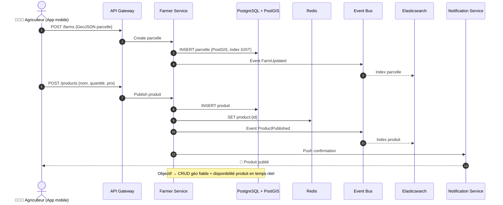
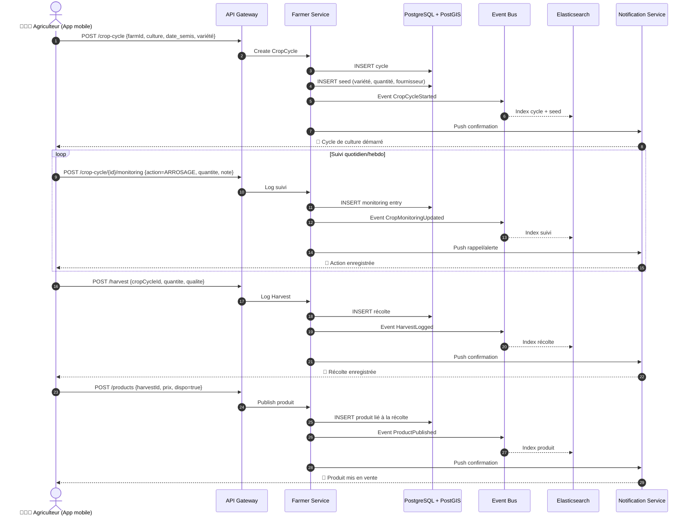

```mermaid
sequenceDiagram
    autonumber
    actor Farmer as 👨🏿‍🌾 Agriculteur (App mobile)
    participant APIGW as API Gateway
    participant FarmerSvc as Farmer Service
    participant DB as PostgreSQL + PostGIS
    participant Cache as Redis
    participant Bus as Event Bus
    participant ES as Elasticsearch
    participant Notif as Notification Service

    Farmer->>APIGW: POST /farms {GeoJSON parcelle}
    APIGW->>FarmerSvc: Create parcelle
    FarmerSvc->>DB: INSERT parcelle (PostGIS, index GIST)
    FarmerSvc->>Bus: Event FarmUpdated
    Bus-->>ES: Index parcelle

    Farmer->>APIGW: POST /products {nom, quantité, prix}
    APIGW->>FarmerSvc: Publish produit
    FarmerSvc->>DB: INSERT produit
    FarmerSvc->>Cache: SET product:{id}
    FarmerSvc->>Bus: Event ProductPublished
    Bus-->>ES: Index produit
    FarmerSvc->>Notif: Push confirmation
    Notif-->>Farmer: 🔔 Produit publié

    Note over FarmerSvc,DB: Objectif → CRUD géo fiable + disponibilité produit en temps réel
```

# Suivi complet d’un cycle de culture

```mermaid
sequenceDiagram
    autonumber
    actor Farmer as 👨🏿‍🌾 Agriculteur (App mobile)
    participant APIGW as API Gateway
    participant FarmerSvc as Farmer Service
    participant DB as PostgreSQL + PostGIS
    participant Bus as Event Bus
    participant ES as Elasticsearch
    participant Notif as Notification Service

    %% === 1. Semis / Début d’un cycle ===
    Farmer->>APIGW: POST /crop-cycle {farmId, culture, date_semis, variété}
    APIGW->>FarmerSvc: Create CropCycle
    FarmerSvc->>DB: INSERT cycle
    FarmerSvc->>DB: INSERT seed (variété, quantité, fournisseur)
    FarmerSvc->>Bus: Event CropCycleStarted
    Bus-->>ES: Index cycle + seed
    FarmerSvc->>Notif: Push confirmation
    Notif-->>Farmer: 🔔 Cycle de culture démarré

    %% === 2. Monitoring (suivi régulier) ===
    loop Suivi quotidien/hebdo
        Farmer->>APIGW: POST /crop-cycle/{id}/monitoring {action=ARROSAGE, quantite, note}
        APIGW->>FarmerSvc: Log suivi
        FarmerSvc->>DB: INSERT monitoring entry
        FarmerSvc->>Bus: Event CropMonitoringUpdated
        Bus-->>ES: Index suivi
        FarmerSvc->>Notif: Push rappel/alerte
        Notif-->>Farmer: 🔔 Action enregistrée
    end

    %% === 3. Récolte ===
    Farmer->>APIGW: POST /harvest {cropCycleId, quantite, qualite}
    APIGW->>FarmerSvc: Log Harvest
    FarmerSvc->>DB: INSERT récolte
    FarmerSvc->>Bus: Event HarvestLogged
    Bus-->>ES: Index récolte
    FarmerSvc->>Notif: Push confirmation
    Notif-->>Farmer: 🔔 Récolte enregistrée

    %% === 4. Mise en vente ===
    Farmer->>APIGW: POST /products {harvestId, prix, dispo=true}
    APIGW->>FarmerSvc: Publish produit
    FarmerSvc->>DB: INSERT produit lié à la récolte
    FarmerSvc->>Bus: Event ProductPublished
    Bus-->>ES: Index produit
    FarmerSvc->>Notif: Push confirmation
    Notif-->>Farmer: 🔔 Produit mis en vente

```